># Swamp Jumper
>## Made by Simon Kašpar
>### Swamp Jumper is a Godot Platformer game, your goal is to get to the end without dying.
>## link to youtube video:
>## https://youtu.be/Qx8dmm1QZWc

>## The game is not yet in its final version
>### Future updates:
>Enemies, Level System, World Map (prepared)
---
># Screenshots from editor
---
>> 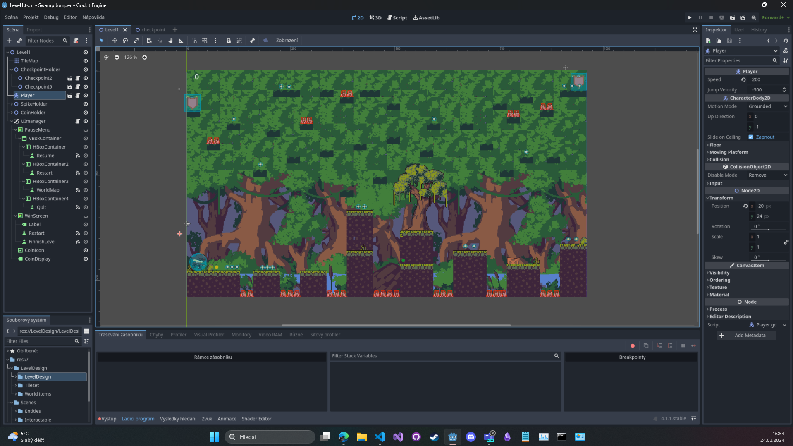
---
>> 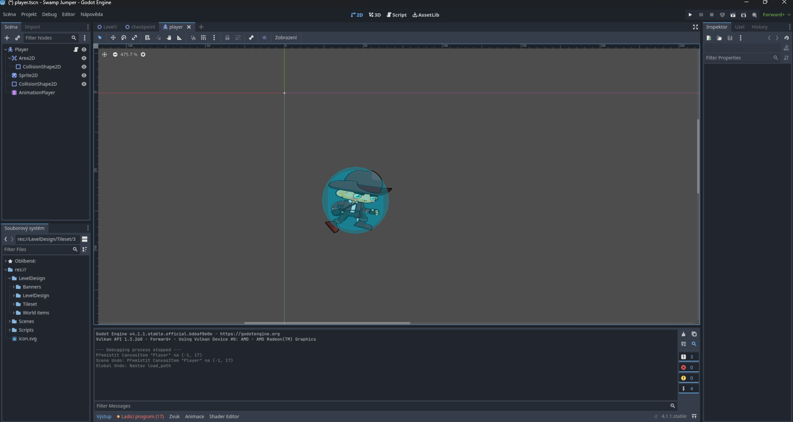
---
>> 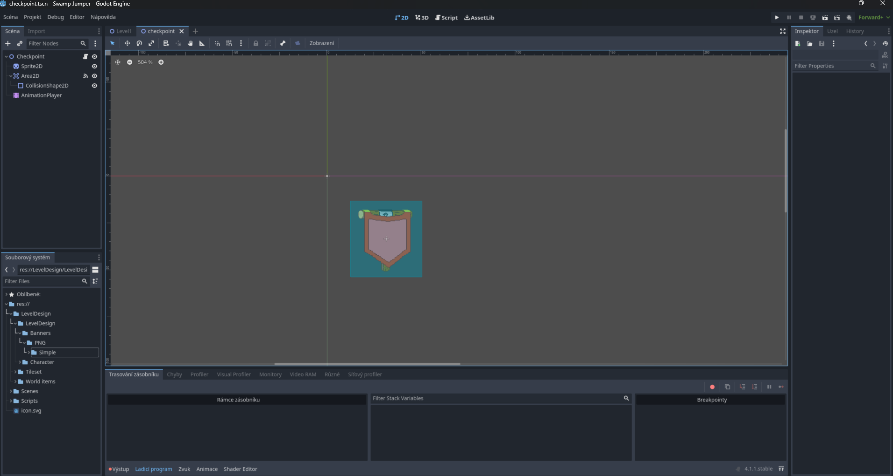
---
>> 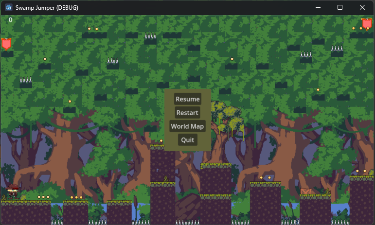
---
>#  Screenshots of asset logic
---
Checkpoints
>> 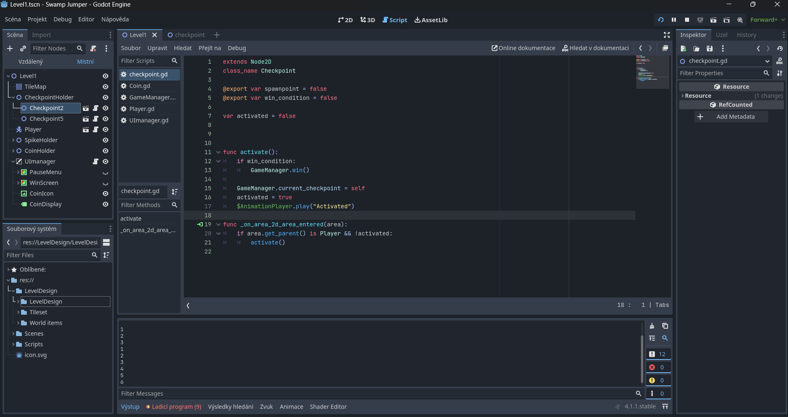
---
Coins
>> 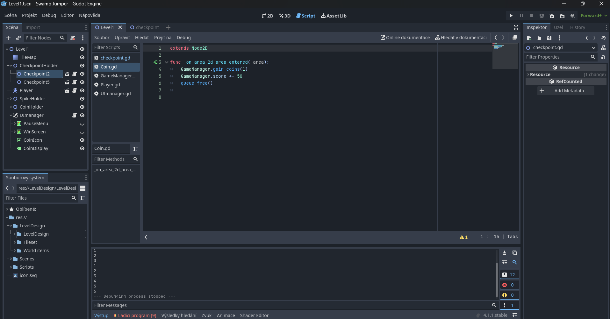
---
GameManager part 1
>> 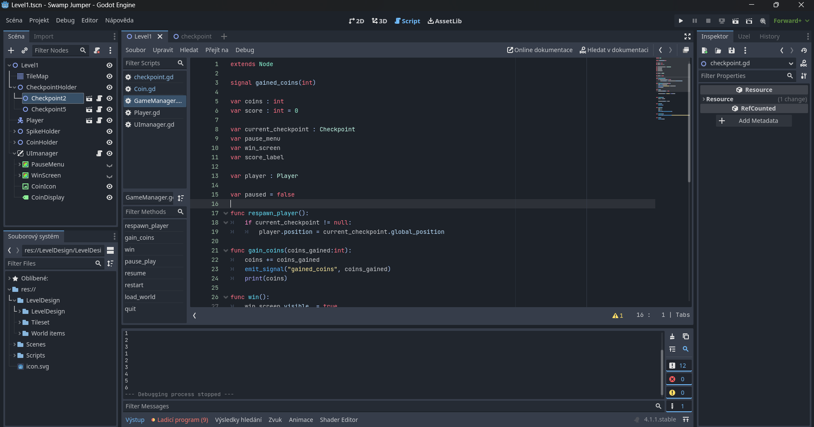
---
GameManager part 2
>> 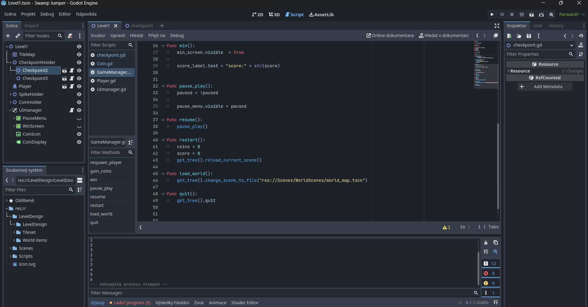
---
Player part 1
>> 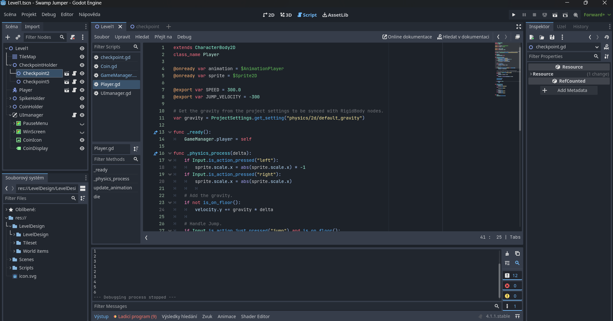
---
Player part 2
>> 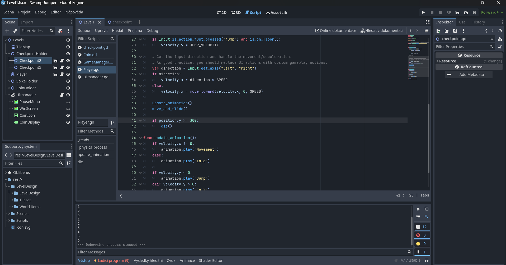
---
Player part 3
>> 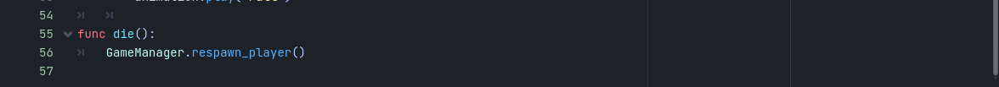
---
Spikes
>> 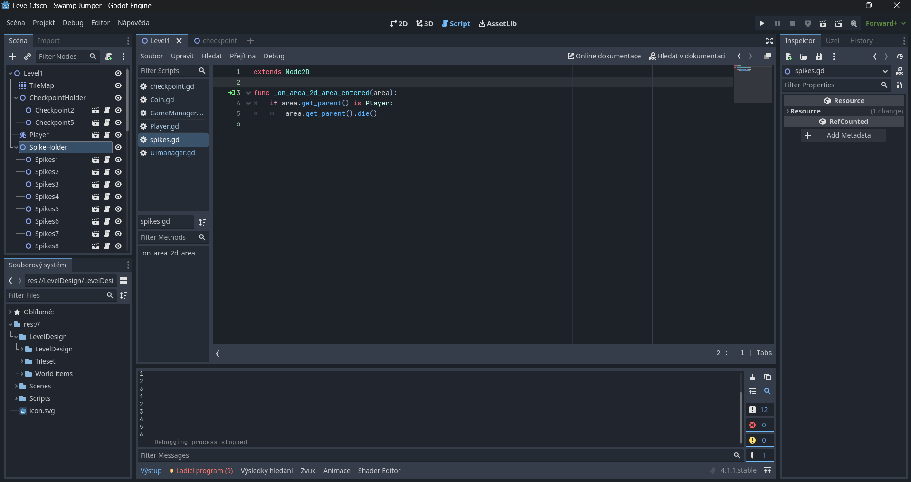
---
UI part 1
>> 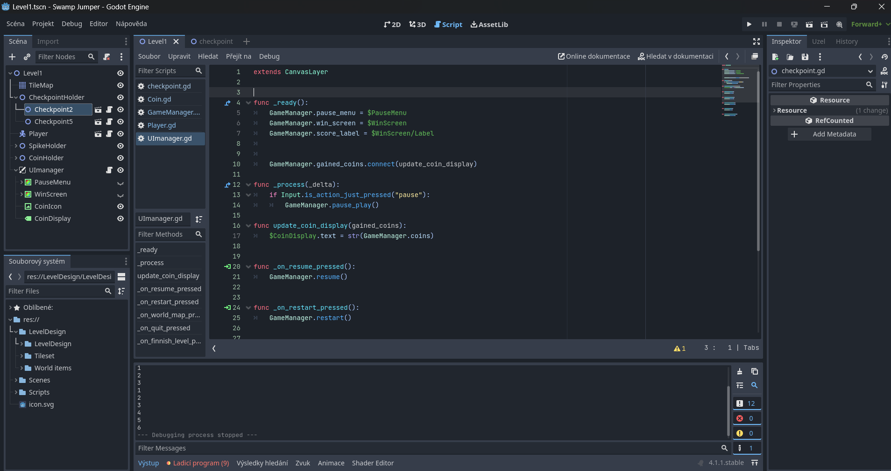
---
UI part 2
>> 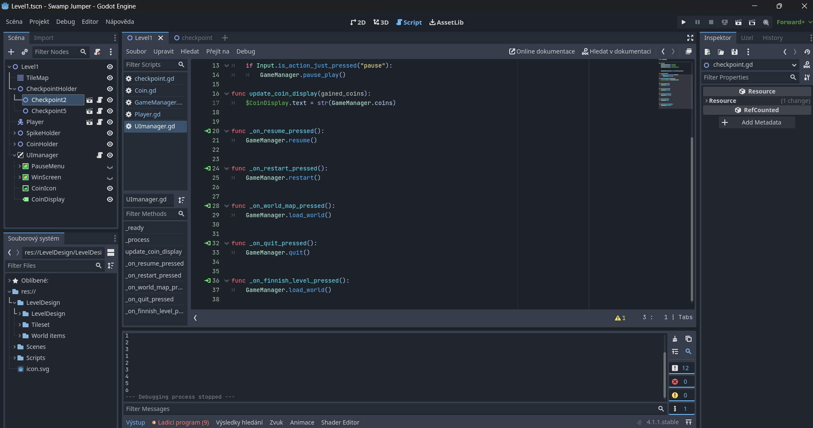

